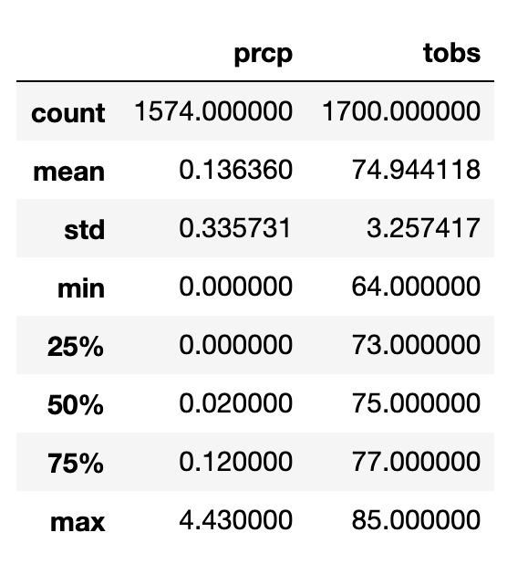
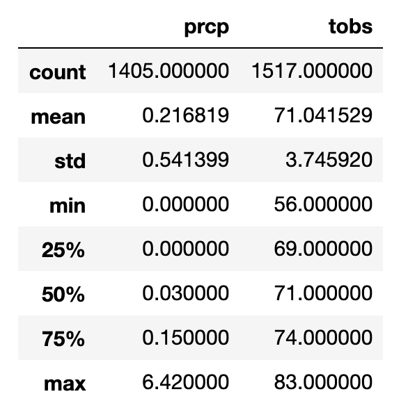

# Surfs_Up

# CHALLENGE ANALYSIS
# Findings
June Stats

December Stats

# Analysis
Looking at both June and December stats, there seems to be a slight difference between both months in all categories. The average precipitation in June is smaller by 0.08 compared to December. The standard deviation in December is greater than the standard deviation in June by 0.2. We can assume, based off of these statistics June gets less rain than December. Looking at the average temperatures for both June and December, there isn't really a big difference between the two months.  

# Recommendations
Recommendation 1 - I would recommend extracting statistical data for each weather stations compared to selecting all weather stations based on the month, that way you can see if business drops based on location due to weather.

Recommendation 2 - I would recommend also extracting the same data but searching based off of a specific year range instead of a spcific month, that way you can see how the most recent years has changed.

Recommendation 3 - I would recommend comparing the statistical data for all the months based off of highest tobs and lowest tobs to see if business has increased or decreased during the times when it was hottest or coldest. 